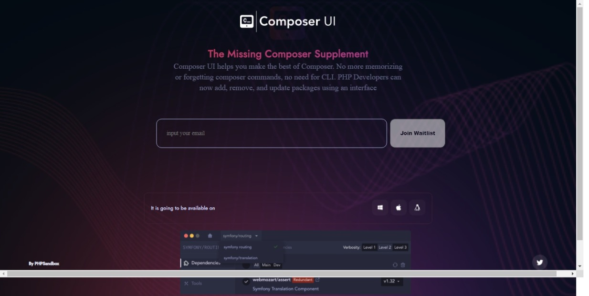

## Table of contents

- [waitlist](#saas-lannding-page)
  - [screenshot](#screenshot)
  - [Links](#links)
  - [My process](#my-process)
  - [Built with](#built-with)
  - [What I learned](#what-i-learned)
  - [Continued development](#continued-development)
  - [Useful resources](#useful-resources)
  - [Author](#author)
- [Acknowledgments](#acknowledgments)

# Saas Landing Page

Users should be able to:

- View the optimal layout depending on their device's screen size

### Screenshot

### Links

Solution Url: (https://github.com/abiodunolayinka/my-first-challenge.git)

### My Process

## Built with

- Semantic HTML5 markup
- CSS custom properties
- Flexbox

### What I learned

This challenge help me to have an average confidence in my progressive knowledge in htlm amd css, and i hope to get better in the process. I was able to know  the use of webkit properties and our i can use responsive properties in my project:

html
<section>Some HTML code I'm proud of</section>

css
.proud-of-this-css {
  flex-direction: column;

### Continued development

i want to focus more on media query, css grid, positioning and javascript, and get prepared for what coming next.

### Useful resourses

- [Google Fonts](https://www.fonts.google.com) - This help me with the various fonts used in my project.
- [Image color picker](https://www.imagecolorpicker.com) - This ihelp me in picking colors from the design given to me.

## Auther
- Twitter - [@yinkxx1](https://www.twitter.com/yinkxx1)
- github - [@olayinka abiodun](https://www.github.com/olayinka abiodun)

## Acknowledgments
 I really want to acknowledge the management ofgrazac academy for giving me this platform to be one of their student to learn and our tutor mr mayowa for his good gesture and his willingness to teach and lastly my coursemates aisha for putting me through.